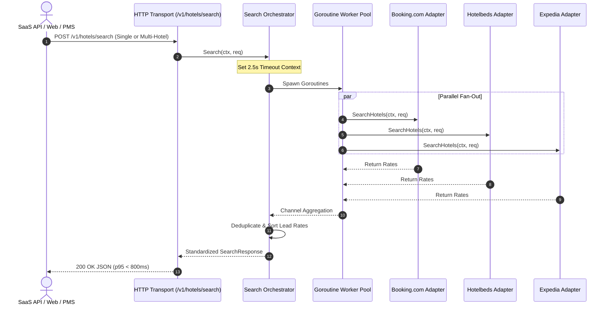

# Hospit Engine Architecture (Golang)

> Technical design and concurrency model of the **Hospit Open Booking Integration Platform** API engine.

---

## 1. Concurrency Model

Hospit is built in Go to handle massive multi-tenant traffic and high-throughput supplier synchronization without the thread-overhead or memory bloat of runtime interpreters:



---

## 2. Directory Layout

```
engine/
├── cmd/
│   └── hospit-server/       # Executable entry point (server bootstrap & signal handlers)
├── pkg/
│   ├── model/               # Universal domain data structures
│   └── connector/           # Pluggable SupplierConnector interface & Registry
├── connectors/
│   └── bookingcom/          # Booking.com Demand v3 & Connectivity switch implementation
├── internal/
│   ├── api/                 # REST HTTP server, handlers & middleware
│   └── orchestrator/        # Parallel Goroutine fan-out & saga coordinator
└── docs/
    ├── ARCHITECTURE.md      # Engine architecture overview
    ├── integrations/        # Specific supplier integration guides (bookingcom.md)
    └── ai/                  # AI-ready context specifications (bookingcom-context.md)
```

---

## 3. Supported Execution Modes

1. **Single-Hotel PMS Direct Connect Mode**:
   - Query targeted hotel via `hotelIds: ["bookingcom:1029384"]`.
   - Direct two-way ARI push via `POST /v1/ari/push?supplier=bookingcom`.
2. **Multi-Hotel B2B Wholesale / Aggregation Mode**:
   - Query geographic area or destination via `location: { latitude, longitude, radiusKm }`.
   - Parallel fan-out across multiple suppliers with lead-rate comparison.
